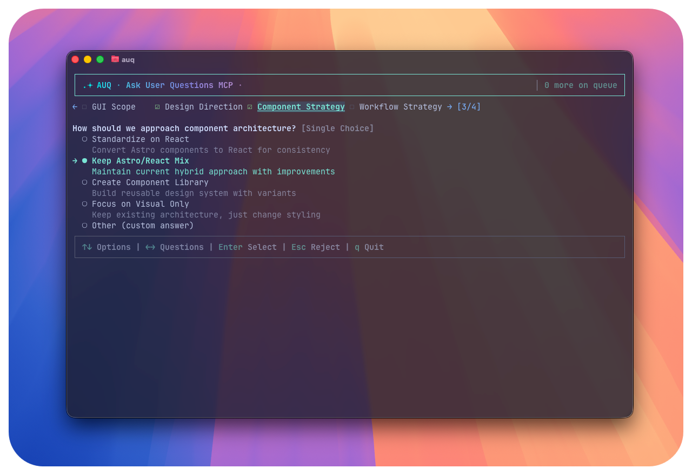

# AUQ - ask-user-questions MCP

[](https://www.npmjs.com/package/auq-mcp-server)
[](https://opensource.org/licenses/MIT)
[](https://cursor.com/en-US/install-mcp?name=ask-user-questions&config=eyJlbnYiOnt9LCJjb21tYW5kIjoibnB4IC15IGF1cS1tY3Atc2VydmVyIHNlcnZlciJ9)

**A lightweight MCP server & CLI tool that allows your LLMs to ask questions to you in a clean, separate space with great terminal UX. Made for multi-agent parallel coding workflows.**

---

## What does it do?

This MCP server lets your AI assistants generate clarifying questions consisting of multiple-choice/single-choice questions (with an "Other" option for custom input) while coding or working, and wait for your answers through a separate CLI tool without messing up your workflow.

You can keep the CLI running in advance, or start it when questions are pending. With simple arrow key navigation, you can select answers and send them back to the AI—all within a clean terminal interface.

## Background

In AI-assisted coding, guiding LLMs to ask **clarifying questions** have been widely recognized as a powerful prompt engineering technique to overcome LLM hallucination and generate more contextually appropriate code [1].

On October 18th, Claude Code 2.0.21 introduced an internal `ask-user-question` tool. Inspired by it, I decided to build a similar tool that is:

- **Tool-agnostic** - Works with any MCP client (Claude Desktop, Cursor, etc.)
- **Non-invasive** - Doesn't heavily integrate with your coding CLI workflow or occupy UI space
- **Multi-agent friendly** - Supports receiving questions from multiple agents simultaneously in parallel workflows

---

## ✨ Features

<https://github.com/user-attachments/assets/3a135a13-fcb1-4795-9a6b-f426fa079674>

### 🖥️ CLI-Based

- **Lightweight**: Adds only ~150 tokens to your context per question
- **SSH-compatible**: Use over remote connections
- **Fast**: Instant startup, minimal resource usage

### 📦 100% Local

All information operates based on your local file system. No data leaves your machine.

### 🔄 Resumable & Stateless

The CLI app doesn't need to be running in advance. Whether the model calls the MCP first and you start the CLI later, or you keep it running—you can immediately answer pending questions in FIFO order.

### ❌ Question Set Rejection with Feedback Loop

When the LLM asks about the wrong domain entirely, you can reject the question set, optionally providing the reason to the LLM. The rejection feedback is sent back to the LLM, allowing it to ask more helpful questions or align on what's important for the project.

### 📋 Question Set Queuing

Recent AI workflows often use parallel sub-agents for concurrent coding. AUQ handles multiple simultaneous LLM calls gracefully—when a new question set arrives while you're answering another, it's queued and processed sequentially. Perfect for multi-agent parallel coding workflows.

---

# Setup Instructions

## 🚀 Step 1: Setup CLI

### Global Installation (Recommended)

```bash
# Install globally
npm install -g auq-mcp-server

# Start the TUI
auq
```

### Local Installation (Project-specific)

```bash
# Install in your project
npm install auq-mcp-server

# Start the TUI from project directory
npx auq
```

**Session Storage:**

- **Global install**: `~/Library/Application Support/auq/sessions` (macOS), `~/.local/share/auq/sessions` (Linux)
- **Local install**: `.auq/sessions/` in your project root

---

## 🔌 Step 2: Setup MCP Server

### Cursor

[](https://cursor.com/en-US/install-mcp?name=ask-user-questions&config=eyJlbnYiOnt9LCJjb21tYW5kIjoibnB4IC15IGF1cS1tY3Atc2VydmVyIHNlcnZlciJ9)

### Claude Code (CLI)

**Method 1: Using CLI** (Recommended)

```bash
claude mcp add --transport stdio ask-user-questions -- npx -y auq-mcp-server server
```

**Method 2: Manual Configuration**

Add to `.mcp.json` in your project root (for team-wide sharing):

```json
{
  "mcpServers": {
    "ask-user-questions": {
      "type": "stdio",
      "command": "npx",
      "args": ["-y", "auq-mcp-server", "server"]
    }
  }
}
```

Or add to `~/.claude.json` for global access across all projects.

**Verify setup:** Type `/mcp` in Claude Code to check server status.

### Codex CLI

Add to `~/.codex/config.toml`:

```toml
[mcp_servers.ask-user-questions]
command = "npx"
args = ["-y", "auq-mcp-server", "server"]
```

**Full configuration example** (with optional settings):

```toml
[mcp_servers.ask-user-questions]
command = "npx"
args = ["-y", "auq-mcp-server", "server"]

# Optional: Additional environment variables
# env = { "AUQ_SESSION_DIR" = "/custom/path" }

# Optional: Whitelist additional env vars
# env_vars = ["AUQ_SESSION_DIR"]


# Optional: Working directory
# cwd = "/Users/<user>/projects"
```

Restart Codex CLI after saving the configuration.

### Claude Desktop

Add to `~/Library/Application Support/Claude/claude_desktop_config.json` (macOS) or `%APPDATA%\Claude\claude_desktop_config.json` (Windows):

```json
{
  "mcpServers": {
    "ask-user-questions": {
      "command": "npx",
      "args": ["-y", "auq-mcp-server", "server"]
    }
  }
}
```

**Restart Claude Desktop** after saving.

---

## 🔌 OpenCode Plugin (Optional)

If you want the OpenCode tool to call `auq ask` directly (without MCP), install
the plugin package and add it to your OpenCode config.

```bash
npm install -g auq-mcp-server
npm install -g @paulp-o/opencode-auq
```

Add to `opencode.json`:

```json
{
  "$schema": "https://opencode.ai/config.json",
  "plugin": ["@paulp-o/opencode-auq"]
}
```

The plugin assumes `auq` is available on `PATH` (global install or equivalent).

---

## 💻 Usage

### Starting the CLI tool

```bash
auq  # if you installed globally
npx auq  # if you installed locally
```

Then just start working with your coding agent or AI assistant. You may prompt to ask questions with the tool the agent got; it will mostly just get what you mean.

### Commands

```bash
# you won't likely need these at all
auq server       # Start MCP server
auq --version    # Show version
auq --help       # Show help
```

---

### Manual session cleanup

Sessions auto-clean after completion or timeout. However, you can manually clean them up if you want to.

```bash
# Global install
rm -rf ~/Library/Application\ Support/auq/sessions/*  # macOS
rm -rf ~/.local/share/auq/sessions/*                  # Linux

# Local install
rm -rf .auq/sessions/*
```

---

## 🚀 Roadmap

- [ ] Light & dark mode themes
- [ ] MCP prompt mode switch (Anthropic style / minimal)
- [ ] Custom color themes
- [ ] Multi-language support
- [ ] Audio notifications on new question
- [ ] Simple option to prompt the LLM to/not ask more questions after answering.
- [ ] Optional 'context' field privided by the LLM, that describes the context of the questions - will be useful for multi-agent coding

---

## 📄 License

MIT License - see [LICENSE](LICENSE) file for details.

---

[1] arXiv:2308.13507 <https://arxiv.org/abs/2308.13507>
