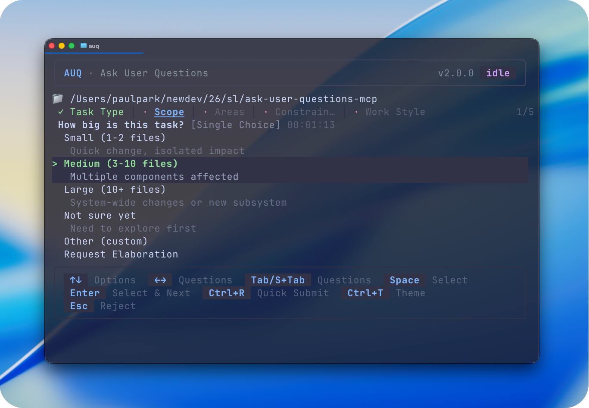

# AUQ - Ask User Questions

_`AskUserQuestion` pushed to the max_


[](https://www.npmjs.com/package/auq-mcp-server)
[](https://opensource.org/licenses/MIT)
[](https://cursor.com/en-US/install-mcp?name=ask-user-questions&config=eyJlbnYiOnt9LCJjb21tYW5kIjoibnB4IC15IGF1cS1tY3Atc2VydmVyIHNlcnZlciJ9)

**A complete toolset that enables maximum level of human-(intention-)in-the-loop onto any long-running, multi-agentic AI workflows (like Ralph Loop!).**

Single/multiple choice questions, custom options, multi-agent interoperability, question queueing, question rejection with explanation, elaboration requesting, quick recommendations auto-selection, themes, native OS notification, terminal progress bar, multi-language support, agent skills support... and more. You can customize them all too!

**Can be used via MCP server / OpenCode plugin / Agent Skills.**

[Setup](#-install-cli-tool) • [Usage](#-usage)

> 🤔 [I already have question tool in CC/OC/Cursor. Why use this?](#-why-auq-vs-built-in-questioning-tools)

---

## What does it do?

AUQ lets your AI assistants **ask clarifying questions** consisting of multiple-choice/single-choice questions (with an "Other" option for custom input / rejection / ask for elaboration) while coding or working, and **wait for your answers** through a **separate CLI window** without messing up your workflow.

This lets you inject your **intent** into long-running autonomous AI tasks—no more switching windows or babysitting AIs. Turn on the CLI **anytime**, even **remotely via SSH**!

<details>
<summary><i>A no no fun background story</i></summary>

In AI-assisted coding, guiding LLMs to ask **clarifying questions** have been widely recognized as a powerful prompt engineering technique to overcome LLM hallucination and generate more contextually appropriate code [1].

On October 18th, Claude Code 2.0.21 introduced an internal `AskUserQuestion` tool. Inspired by it, I decided to build a similar tool that is:

- **Integration-flexible** - Works with MCP clients (Claude Desktop, Cursor, etc.) and has official OpenCode plugin support
- **Non-invasive** - Doesn't heavily integrate with your coding CLI workflow or occupy UI space
- **Multi-agent friendly** - Supports receiving questions from multiple agents simultaneously in parallel workflows

</details>

---

## ✨ Demo

<https://github.com/user-attachments/assets/3a135a13-fcb1-4795-9a6b-f426fa079674>

---

# Setup Instructions

## 🚀 Install CLI Tool

First, install the **AUQ CLI**:

### Global Installation (Recommended)

```bash
# Install globally
bun add -g auq-mcp-server
```

This serves as the 'answering interface' for you, the human.

_**Note:** Other package managers (npm, pnpm..) also work but not recommended._

<details><summary>Local (Project-specific) Installation</summary>

```bash
# Install in your project
bun add auq-mcp-server
```

Sessions are stored **globally** regardless of installation method. See [Troubleshooting](#troubleshooting) for session locations.

</details>

---

## 🔌 Integrate to your AI

AUQ supports multiple AI environments. Choose between **OpenCode plugin** and **MCP server**.

### Option A: MCP Server

> _Note: Due to differences in how some MCP clients are implemented, AUQ may be forcibly cancelled in tools that do not allow extending the global MCP timeout. If that's the case, consider using [Agent Skills](#option-c-agent-skills-experimental). Use [OpenCode plugin](#option-b-opencode-plugin) if you use OpenCode._

<details>
<summary><strong>Cursor</strong></summary>

[](https://cursor.com/en-US/install-mcp?name=ask-user-questions&config=eyJlbnYiOnt9LCJjb21tYW5kIjoibnB4IC15IGF1cS1tY3Atc2VydmVyIHNlcnZlciJ9)

</details>

<details>
<summary><strong>Claude Code</strong></summary>

**Method 1: Using CLI** (Recommended)

```bash
claude mcp add --transport stdio ask-user-questions -- bunx -y auq-mcp-server server
```

> **Note:** `npx` also works if you prefer npm.

**Method 2: Manual Configuration**

Add to `.mcp.json` in your project root (for team-wide sharing):

```json
{
  "mcpServers": {
    "ask-user-questions": {
      "type": "stdio",
      "command": "bunx",
      "args": ["-y", "auq-mcp-server", "server"]
    }
  }
}
```

Or add to `~/.claude.json` for global access across all projects.

_**Note:** Replace `bunx` if you don't use bun._

**Verify setup:** Type `/mcp` in Claude Code to check server status.

</details>

<details>
<summary><strong>Codex CLI</strong></summary>

Add to `~/.codex/config.toml`:

```toml
[mcp_servers.ask-user-questions]
command = "bunx"
args = ["-y", "auq-mcp-server", "server"]
tool_timeout_sec = 99999  // Extend timeout for long sessions
```

</details>

<details>
<summary><strong>Claude Desktop</strong></summary>

Add to `~/Library/Application Support/Claude/claude_desktop_config.json` (macOS) or `%APPDATA%\Claude\claude_desktop_config.json` (Windows):

```json
{
  "mcpServers": {
    "ask-user-questions": {
      "command": "bunx",
      "args": ["-y", "auq-mcp-server", "server"]
    }
  }
}
```

> _Replace `bunx` if you don't use bun._

**Restart Claude Desktop** after saving.

</details>

### Option B: OpenCode Plugin

**Direct integration** for OpenCode users. Adds working directory viewability feature exclusively.

#### Configuration

Add to `opencode.json`:

```json
{
  "plugin": ["@paulp-o/opencode-auq@latest"]
}
```

### Option C: Agent Skills (Experimental)

#### Usage with Skills-Compatible Agents

Copy the `skills/ask-user-questions/` folder to your agent's skills directory.

<details>
<summary><strong>Limitations</strong></summary>

This skill guides the AI to use AUQ CLI's hidden command, `auq ask` with raw JSON as parameters. Unlike MCP or _proper_ tool harness systems, malformed JSON healing/schema enforcement aren't supported natively; therefore a less capable model could struggle to call properly.

</details>

---

## 💻 Usage

### Starting the CLI tool

```bash
auq       # if installed globally (bun add -g)
# bunx auq
# npx auq
```

Start by defining your workflow to use AUQ tool for clarifying questions, on `AGENTS.md` (or `CLAUDE.md`), like:

```markdown
Whenever you need clarification on what you are working on, never guess, and call AUQ(ask-user-questions).
```

When the AI asks questions, you'll see them appear in the AUQ TUI. Answer them **at your convenience**.

### Markdown rendering in question prompts

Question prompts now support **Markdown formatting** in the `prompt` text.

- Supported: **bold**, _italic_, ~~strikethrough~~, `inline code`, links, and fenced code blocks (with syntax highlighting)
- Links render as `text (url)` for broad terminal compatibility
- Code blocks use theme-aware colors (background/text/border)
- Always enabled (no configuration needed)
- Plain text prompts pass through unchanged
- Graceful fallback: if Markdown parsing fails, the raw text is shown

> _Note: AUQ is an unopinionated tool and doesn't include prompts on **HOW** AI should leverage it. It is expected that you do your own prompt engineering to make the most out of it in your own workflows._
> _I personally enjoy prompting it to ask at least 30 questions repeatedly before action!_

### Recommended Setups

It is recommended to **disable** the built-in questioning tool in your harness (like the `question` tool in OpenCode or `AskUserQuestion` in Claude Code) to avoid AI from mixing them up.

### Useful Keyboard Shortcuts

| Key      | Action        | Description                                                        |
| -------- | ------------- | ------------------------------------------------------------------ |
| `Space`  | Select        | Select/toggle option without advancing                             |
| `Enter`  | Select & Next | Select option and advance to next question                         |
| `R`      | Recommended   | Select recommended option(s) for current question                  |
| `Ctrl+R` | Quick Submit  | Auto-select recommended options for all questions and go to review |
| `Esc`    | Reject        | Reject the whole question set and optionally explain why to the AI |
| `Ctrl+T` | Theme         | Cycle through available color themes                               |

<details>
<summary><strong>More Commands (advanced)</strong></summary>

```bash
# you won't likely need these at all
auq server       # Start MCP server
auq --version    # Show version
auq update       # Check for and install updates
auq --help       # Show help
```

</details>

---

### CLI Commands

AUQ provides headless CLI commands for managing sessions and configuration without the TUI.

#### Answer Sessions

```bash
# Answer a session with JSON answers
auq answer <sessionId> --answers '{"0": {"selectedOption": "option1"}}'

# Reject a session
auq answer <sessionId> --reject --reason "Not applicable"

# Force answer an abandoned session
auq answer <sessionId> --answers '...' --force

# JSON output
auq answer <sessionId> --answers '...' --json
```

#### Manage Sessions

```bash
# List pending sessions
auq sessions list

# List stale sessions only
auq sessions list --stale

# List all sessions (including completed, abandoned)
auq sessions list --all

# Dismiss/archive a session
auq sessions dismiss <sessionId>

# JSON output
auq sessions list --json
```

#### Configuration

```bash
# View all configuration
auq config get

# View specific setting
auq config get staleThreshold

# Set a value (local .auqrc.json)
auq config set staleThreshold 3600000

# Set globally
auq config set staleThreshold 3600000 --global
```

---

### Stale Session Detection

Sessions that remain unanswered longer than the configured threshold are marked as "stale" (potentially orphaned). This helps identify sessions where the AI may have disconnected or timed out.

- **Visual indicators**: Stale sessions show a ⚠ warning icon and yellow highlighting in the TUI
- **Toast notifications**: A notification appears when a session becomes stale (configurable)
- **Grace period**: Interacting with a stale session provides a 30-minute grace period
- **Configurable threshold**: Default is 2 hours (7,200,000ms)

---

### Abandoned Session Handling

When an AI client disconnects, associated sessions are marked as "abandoned". These sessions:

- Remain visible in the TUI with a red indicator
- Show a confirmation dialog before answering ("AI가 disconnect되었습니다")
- Can still be answered via CLI with the `--force` flag
- Are detectable via `auq sessions list --all`

---

### Auto-Update

AUQ automatically checks for updates and keeps itself up to date.

#### How it works

- **Patch updates** (e.g., 2.4.0 → 2.4.1): Automatically installed when the TUI starts. These are bug fixes and minor improvements.
- **Minor/Major updates** (e.g., 2.4.0 → 2.5.0 or 3.0.0): A fullscreen prompt is shown with changelog and options to update, skip, or defer.
- **CLI notification**: When running non-TUI commands, a one-line update notification is shown if a newer version is available.

#### Manual update

Run `auq update` to manually check for and install updates:

```bash
auq update        # Interactive update check
auq update -y     # Skip confirmation prompt
```

#### Disabling update checks

Disable automatic update checks via config:

```bash
auq config set updateCheck false
```

Or set the environment variable:

```bash
NO_UPDATE_NOTIFIER=1 auq ask "question"
```

Update checks are automatically disabled in CI environments (`CI=true`).

The `auq update` command always works regardless of these settings.

### 🎨 Themes

AUQ supports **16 built-in color themes** with automatic persistence. Press `Ctrl+T` to cycle through themes.

<details>
<summary><strong>Built-in Themes</strong></summary>

| Theme            | Style                    |
| ---------------- | ------------------------ |
| AUQ dark         | Default dark theme       |
| AUQ light        | Default light theme      |
| Nord             | Arctic, bluish           |
| Dracula          | Dark purple/pink         |
| Catppuccin Mocha | Warm dark pastels        |
| Catppuccin Latte | Warm light pastels       |
| Solarized Dark   | Low contrast dark        |
| Solarized Light  | Low contrast light       |
| Gruvbox Dark     | Retro groove dark        |
| Gruvbox Light    | Retro groove light       |
| Tokyo Night      | Dark with vibrant colors |
| One Dark         | Atom-inspired dark       |
| Monokai          | Classic vibrant dark     |
| GitHub Dark      | GitHub's dark mode       |
| GitHub Light     | GitHub's light mode      |
| Rosé Pine        | Warm, cozy pinks         |

</details>

Your selected theme is **automatically saved** to `~/.config/auq/config.json` and restored on next launch.

<details>
<summary><strong>Custom Themes</strong></summary>

Create custom themes by placing `.theme.json` files in:

- **macOS/Linux**: `~/.config/auq/themes/`

Example custom theme (`~/.config/auq/themes/my-theme.theme.json`):

```json
{
  "name": "my-theme",
  "colors": {
    "primary": "#ff6b6b",
    "success": "#51cf66",
    "text": "#f8f9fa"
  }
}
```

Custom themes inherit from the default dark theme—only override the colors you want to change. See the [JSON schema](schemas/theme.schema.json) for all available properties.

</details>

---

### Manual session cleanup

Sessions auto-clean after retention period. However, you can manually clean them up if you want to.

```bash
rm -rf ~/Library/Application\ Support/auq/sessions/*  # macOS
rm -rf ~/.local/share/auq/sessions/*                  # Linux
```

---

<details>
<summary><strong>Local Development & Testing</strong></summary>

To test the MCP server and CLI locally during development:

### 1. Start the MCP Server (Terminal 1)

```bash
# Option A: Run with tsx (recommended for development)
bun run start

# Option B: Run with fastmcp dev mode (includes web inspector at http://localhost:6274)
bun run dev

# Option C: Run the built version
bun run build && bun run server
```

### 2. Create a Test Session (Terminal 2)

Use the `auq ask` command to create a session and wait for answers:

```bash
# Run directly with bun during development
bun run bin/auq.tsx ask '{"questions": [{"prompt": "Which language?", "title": "Lang", "options": [{"label": "TypeScript"}, {"label": "Python"}], "multiSelect": false}]}'

# Or pipe JSON to stdin
echo '{"questions": [{"prompt": "Which database?", "title": "DB", "options": [{"label": "PostgreSQL"}, {"label": "MongoDB"}], "multiSelect": false}]}' | bun run bin/auq.tsx ask
```

This will create a session and wait for the TUI to provide answers.

### 3. Answer with the TUI (Terminal 3)

```bash
# Run the TUI to answer pending questions
bun run bin/auq.tsx
```

### Create Mock Sessions for TUI Testing

To test the TUI with multiple pending sessions:

```bash
# Create 3 mock sessions (default)
bun run scripts/create-mock-session.ts

# Create a specific number of sessions
bun run scripts/create-mock-session.ts 5
```

Then run the TUI to see and answer them:

```bash
bun run bin/auq.tsx
```

### Verify MCP and CLI Use Same Session Directory

Both components should report the same session directory path. Check the logs:

- MCP server logs session directory on startup
- `auq ask` prints `[AUQ] Session directory: <path>` to stderr

On macOS, both should use: `~/Library/Application Support/auq/sessions`

### Development Commands

```bash
# Regenerate the skill from source
bun run generate:skill

# Validate skill structure and content
bun run validate:skill
```

</details>

<details>
<summary><strong>Troubleshooting</strong></summary>

### Session Storage

Sessions are stored in platform-specific global locations:

- **macOS**: `~/Library/Application Support/auq/sessions`
- **Linux**: `~/.local/share/auq/sessions` (or `$XDG_DATA_HOME/auq/sessions`)
- **Windows**: `%APPDATA%\auq\sessions`

_Can be customized with `AUQ_SESSION_DIR` environment variable._

</details>

<details>
<summary><strong>Configuration</strong></summary>

AUQ can be configured via a `.auqrc.json` file. Settings are loaded from (in priority order):

1. **Local**: `./.auqrc.json` (project directory)
2. **Global**: `~/.config/auq/.auqrc.json` (or `$XDG_CONFIG_HOME/auq/.auqrc.json`)
3. **Defaults**: Built-in values

_Settings from local config override global config, which overrides defaults._

### Default Configuration

```json
{
  "maxOptions": 5,
  "maxQuestions": 5,
  "recommendedOptions": 4,
  "recommendedQuestions": 4,
  "sessionTimeout": 0,
  "retentionPeriod": 604800000, // 7 days
  "language": "auto",
  "theme": "system",
  "autoSelectRecommended": true,
  "updateCheck": true,
  "notifications": {
    "enabled": true,
    "sound": true
  }
}
```

<details>
<summary><strong>Available Settings</strong></summary>

| Setting                 | Type    | Default   | Range/Values                    | Description                                           |
| ----------------------- | ------- | --------- | ------------------------------- | ----------------------------------------------------- |
| `maxOptions`            | number  | 5         | 2-10                            | Maximum options per question                          |
| `maxQuestions`          | number  | 5         | 1-10                            | Maximum questions per session                         |
| `recommendedOptions`    | number  | 4         | 1-10                            | Suggested number of options (for AI guidance)         |
| `recommendedQuestions`  | number  | 4         | 1-10                            | Suggested number of questions (for AI guidance)       |
| `language`              | string  | "auto"    | "auto", "en", "ko"              | UI language (auto-detects from system if "auto")      |
| `theme`                 | string  | "system"  | "system", "dark", "light", etc. | Color theme for TUI                                   |
| `sessionTimeout`        | number  | 0         | 0+ (milliseconds)               | Session timeout (0 = no timeout)                      |
| `retentionPeriod`       | number  | 604800000 | 0+ (milliseconds)               | How long to keep completed sessions (default: 7 days) |
| `notifications.enabled` | boolean | true      | true/false                      | Enable desktop notifications for new questions        |
| `notifications.sound`   | boolean | true      | true/false                      | Play sound with notifications                         |
| `staleThreshold`        | number  | 7200000   | 0+ (milliseconds)               | Time before a session is considered stale (2 hours)   |
| `notifyOnStale`         | boolean | true      | true/false                      | Show toast notification when sessions become stale    |
| `staleAction`           | string  | "warn"    | "warn", "remove", "archive"     | Action for stale sessions                             |
| `updateCheck`           | boolean | true      | true/false                      | Enable automatic update checks on startup             |

</details>

### Language Support

AUQ supports multiple languages for the TUI interface:

- **English** (`en`) - Default
- **Korean** (`ko`) - 한국어

Language is auto-detected from system locale (`LANG`, `LC_ALL`, `LC_MESSAGES` environment variables) when set to `"auto"`.

### Desktop Notifications

AUQ uses native desktop notifications to alert you when new questions arrive.

#### Platform Requirements

| Platform | Status                  | Notes                                         |
| -------- | ----------------------- | --------------------------------------------- |
| macOS    | ✅ Works out of the box | Uses Notification Center                      |
| Windows  | ✅ Works out of the box | Uses Action Center                            |
| Linux    | ⚠️ Requires libnotify   | Install: `sudo apt-get install libnotify-bin` |

Notifications can be disabled in configuration if needed.

**Features:**

- **Batched Notifications**: Rapid session arrivals are batched into a single notification
- **Progress Bar**: Shows question completion progress in terminal dock icon (supported terminals like iTerm2 and WezTerm)
- **Native Integration**: Uses system-native notification centers

**Configuration:**

```json
{
  "notifications": {
    "enabled": true,
    "sound": true
  }
}
```

- `notifications.enabled` (default: `true`): Enable desktop notifications
- `notifications.sound` (default: `true`): Play sound with notifications

Set `notifications.enabled` to `false` to disable all notifications.

</details>

---

## 🤔 Why AUQ vs. Built-in Questioning Tools?

> **A clean decision inbox so you & AI stay in flow.**

You're an AI power user, running multiple agents on multiple instances. Highly parallelized, the AIs ask questions to you simultaneously, on multiple threads—scattered across different windows. AUQ enables them to ask **anytime**, collects everything in **one inbox**, and lets you respond **on your terms**—then elegantly routes answers back to each agent.

```
       Claude Code    Cursor    OpenCode
            │           │           │
            ▼           ▼           ▼
          ┌─────────────────────────────┐
          │        📥 AUQ Inbox         │
          └─────────────────────────────┘
                        │
                        ▼
                      🖥️ TUI
                        │
                        ▼
          ┌─────────────────────────────┐
          │       Your Answers          │
          └─────────────────────────────┘
            │           │           │
            ▼           ▼           ▼
       Claude Code    Cursor    OpenCode
```

📥 **One Inbox for All Agents** — Multiple agents ask in one place. One queue, one source of truth.

🧠 **Teach the AI** — Reject bad questions and tell it why. Turn "no" into better follow-ups.

❓ **Fix the Question First** — Can't answer because it's vague? Request **elaboration** before you guess.

⚡ **Blast Through the Obvious** — `Ctrl+R` accepts all **recommended** options. Focus on the hard decisions.

🔔 **Pinged When It Matters** — Native notifications, **batched** so you're not spammed.

🌐 **Works Where You Work** — SSH into a remote server? AUQ runs there too.

<details>
<summary><strong>Nice Extras</strong></summary>

- 🎨 16 built-in themes + custom theme support
- 🌍 i18n (English, Korean) with auto-detection
- 📊 Dock progress bar (iTerm2, WezTerm, Ghostty)
- 🔤 Full CJK character support

#### Power Moves

| Shortcut | What it does                                       |
| -------- | -------------------------------------------------- |
| `Space`  | Select option without advancing                    |
| `Enter`  | Select option and advance to next question         |
| `R`      | Select recommended option(s) for current question  |
| `Ctrl+R` | Quick submit — auto-fill recommended, go to review |
| `Esc`    | Reject question set — optionally explain why       |
| `Ctrl+T` | Cycle through 16 themes                            |

</details>

---

## 📄 License

MIT License - see [LICENSE](LICENSE) file for details.

---

[1] arXiv:2308.13507 <https://arxiv.org/abs/2308.13507>
