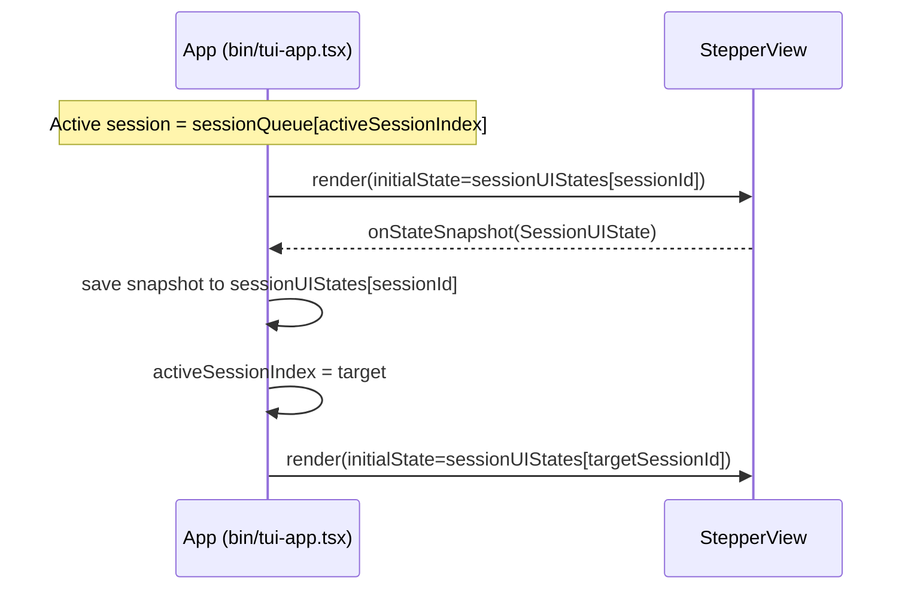

## Context

The TUI currently supports receiving multiple sessions (a queue), but it processes them strictly FIFO by consuming the front of the array. This prevents users from switching between queued sessions and causes per-session UI state (current question, answers, focus) to be lost whenever the Stepper UI is unmounted.

This change introduces “queued session switching”: while a session is in progress, the user can move to another queued session, then return later and continue from the same place.

Current implementation constraints (as of today):

- The queue is `sessionQueue: SessionData[]` in `bin/tui-app.tsx` and is consumed FIFO (pop/shift from the front).
- App mode is modeled as `{ mode: "WAITING" } | { mode: "PROCESSING"; session: SessionData }`.
- Per-session UI state lives inside `src/tui/components/StepperView.tsx` React component state and is lost on unmount.

## Goals / Non-Goals

- Goals:
  - Preserve Stepper UI state per session when switching between queued sessions.
  - Provide fast keyboard-first session switching (`Ctrl+]`, `Ctrl+[`, `1-9`, `Ctrl+S`) without breaking existing Stepper shortcuts.
  - Provide a lightweight on-screen affordance for “multiple sessions exist” and which is active.
- Non-Goals:
  - Persist session UI state across process restarts.
  - Introduce new server/protocol features; this is a TUI behavior + UI change.
  - Enable switching while in “review/confirm” sub-flows (switching is intentionally gated there).

## Decisions

- Decision: Replace FIFO consumption with indexed navigation.
  - What: Keep `sessionQueue` as the array of all pending/active sessions and add `activeSessionIndex: number` to select which session is displayed.
  - Why: Switching requires that sessions remain addressable; consuming the queue destroys the ability to navigate.
  - Alternatives considered:
    - Keep FIFO pop model and maintain a “back stack” of previously seen sessions (adds complexity and still requires state preservation).
    - Render multiple Stepper instances concurrently and hide inactive ones (keeps state implicitly, but increases render cost/complexity and complicates global input handling).

- Decision: Introduce a per-session UI state store in the parent App.
  - What: Add `sessionUIStates: Record<sessionId, SessionUIState>` in the App (in `bin/tui-app.tsx`) and treat `StepperView` as a view over that stored state.
  - Why: Component-local React state is lost on unmount; storing per session in the parent allows state preservation across session switches.
  - State shape:

    ```ts
    interface SessionUIState {
      currentQuestionIndex: number;
      answers: Map<number, Answer>;
      elaborateMarks: Map<number, string>;
      focusContext: "option" | "custom-input" | "elaborate-input";
      focusedOptionIndex: number;
      showReview: boolean; // switching disabled on review, but preserved for edge cases
    }
    ```

  - Alternatives considered:
    - Move Stepper state into a global store library (e.g., Zustand/Redux). Rejected to avoid introducing new dependencies for a narrowly-scoped use.
    - Serialize the state to JSON and store it as plain objects. Rejected for initial implementation; `Map` usage is already natural in current Stepper state. (If needed later, we can normalize to arrays for persistence.)

- Decision: StepperView supports external initialization + state export.
  - What:
    - `src/tui/components/StepperView.tsx` accepts `initialState?: SessionUIState` and initializes its internal UI from it.
    - StepperView exposes current UI state via a callback (e.g., `onStateChange` or `onStateSnapshot`) so the parent can save on switch-away.
  - Why: Stepper remains the owner of its internal interactions, but the parent becomes the owner of cross-session lifecycle.

- Decision: Save/restore state on session switch.
  - Save: When the user switches away from the active session, capture the current Stepper UI state and store it into `sessionUIStates[currentSessionId]`.
  - Restore: When switching to a target session, load any existing `sessionUIStates[targetSessionId]` and pass it as `initialState` to StepperView.
  - Cleanup:
    - On completion: remove the session from `sessionQueue` and delete its `sessionUIStates` entry.
    - On timeout while paused: remove from both and show a toast/notice to the user.

- Decision: Global session-switching keyboard handler at the App level.
  - What: A global `useInput` handler in the App component (above StepperView) handles session switching shortcuts.
  - Gating rules (must all be true):
    - `state.mode === "PROCESSING"`
    - current Stepper is not in review (`!showReview`)
    - not in “rejection confirm” flow (`!showRejectionConfirm`)
    - session picker overlay is not open (overlay takes full focus)
  - Why: Session switching is cross-cutting navigation and should not be owned by StepperView; Stepper’s existing shortcuts remain unchanged.
  - Shortcuts:
    - `Ctrl+]`: next session
    - `Ctrl+[`: previous session
    - `1-9`: direct session index selection (1-based)
    - `Ctrl+S`: open session picker overlay
  - Trade-off: `Ctrl+]` / `Ctrl+[` can be intercepted by some terminal emulators; chosen anyway because these are common tmux bindings and widely supported.

- Decision: Add two new UI components to make switching discoverable and efficient.
  - `src/tui/components/SessionDots.tsx`
    - Rendered only when `sessionQueue.length >= 2`.
    - A compact row below the footer with numbered dots (e.g., `● 1  ○ 2  ○ 3`).
    - Color coding:
      - green: has answers
      - yellow: in progress
      - dim/white: untouched
    - Active session: filled dot + theme primary color.
  - `src/tui/components/SessionPicker.tsx`
    - Modal overlay opened with `Ctrl+S`.
    - Centered, bordered list. Each row includes:
      - `{index}. {firstQuestionTitle} — {workingDir}  [{answered}/{total}]  {age}`
    - Keyboard navigation: ↑/↓, Enter selects, Esc closes.
    - Active session row is highlighted.
    - While open, it takes full focus (all other input handlers disabled).

- Decision: Session identity and display labels.
  - Primary label: `sessionRequest.questions[0].title`.
  - Secondary label: `sessionRequest.workingDirectory` (if missing, show `unknown` or omit based on layout constraints).
  - Progress label: answered count vs total questions.
  - Age label: relative time derived from `sessionData.timestamp` (e.g., `2m ago`).

## Risks / Trade-offs

- Memory: Storing per-session UI state in memory grows with session count.
  - Mitigation: State is small (maps of primitives). In practice, sessions are expected to be few (often <= 9).
- StepperView refactor: Stepper currently owns its state completely.
  - Mitigation: Keep Stepper logic local; add only `initialState` + state export callback. Avoid redesigning Stepper internals.
- Keyboard conflicts: Terminal/OS may intercept certain Ctrl key combos.
  - Mitigation: Provide `Ctrl+S` picker as a reliable alternative; keep numeric selection as another path.
- Index shifting bugs: Removing a session shifts indices and can cause off-by-one errors.
  - Mitigation: Centralize removal logic and ensure `activeSessionIndex` is adjusted when the removed index is < current index, and clamped when removing the active session.

## Migration Plan

1. Refactor queue model in `bin/tui-app.tsx`:
   - Keep `sessionQueue` as the full list.
   - Add `activeSessionIndex`.
   - Add `sessionUIStates` keyed by stable `sessionId`.
2. Update `src/tui/components/StepperView.tsx`:
   - Add `initialState?: SessionUIState`.
   - Add a state snapshot callback used during session switches.
3. Add global keyboard handler in the App:
   - Implement next/prev/index selection.
   - Add `Ctrl+S` overlay toggle and input focus gating.
4. Add UI affordances:
   - `src/tui/components/SessionDots.tsx` and render below `src/tui/components/Footer.tsx`.
   - `src/tui/components/SessionPicker.tsx` overlay for selection.
5. Integrate lifecycle cleanup:
   - On completion/rejection: remove session + state.
   - On timeout: remove session + state and notify.

Rollback approach:

- If switching introduces regressions, disable the switch shortcuts and hide SessionDots/SessionPicker while keeping the underlying queue model changes localized to the App.

## Open Questions

- Timeout handling: confirm whether timeouts are best detected via an existing watcher callback or a periodic timer within the App, and what UX copy to show when a paused session is removed.


